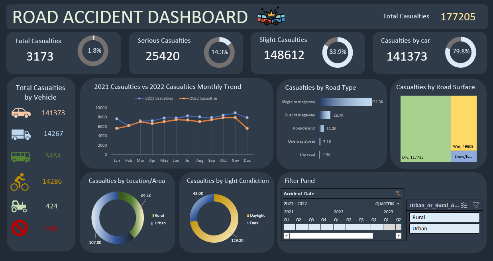

# Road Accident Data Analysis

## Overview

This project presents an analysis of road accident data using an interactive dashboard.

The dashboard provides an overview of casualties and allows the data to be explored from different perspectives, including vehicle type, road type, road surface, location, light conditions and accident date.

## Dashboard

The dashboard summarizes the main road accident statistics:

- **Total casualties:** 177,205
- **Fatal casualties:** 3,173
- **Serious casualties:** 25,420
- **Slight casualties:** 148,612
- **Casualties by car:** 141,373

It also includes interactive filters for:
- Accident date
- Year and quarter
- Urban and rural areas

## Key Visualizations

The dashboard contains visualizations showing:

- Total casualties by vehicle type
- Monthly casualties comparison between 2021 and 2022
- Casualties by road type
- Casualties by road surface
- Casualties by rural and urban location
- Casualties by light conditions

## Dashboard Preview

## Main Insights

The dashboard makes it possible to identify several patterns in the accident data.

The majority of casualties are classified as **slight casualties**, while fatal casualties represent a much smaller proportion of the total.

Cars account for the largest share of casualties compared with other vehicle categories.

The dashboard also allows comparisons between different road types, road surfaces and environmental conditions.

## Tools

- Microsoft Excel
- Data visualization
- Dashboard design
- Data analysis

## Project Purpose

The project was created to practice data analysis and visualization techniques and to present road accident data in a clear and interactive dashboard.

## Author

**Dominika Schabowska**
